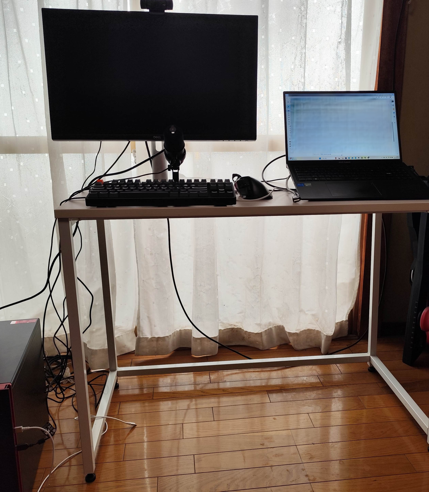
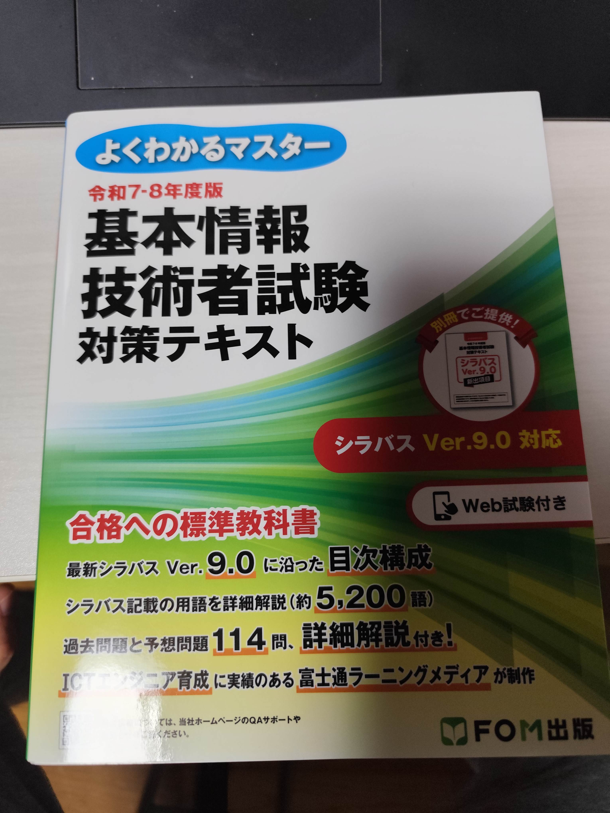

# HoneyFish 強化学習実施のためのLateBloomTech 学習環境（ハード／ソフト）構築プロジェクト

## 1. このプロジェクトについて
本プロジェクトは、自身のAI開発・機械学習における **「開発環境の壁」と「基礎知識の壁」** という2つの課題を解決するため、要件定義から始まるアジャイルな開発アプローチを用いて、持続可能な学習・開発環境を構築する試みです。
>現在は学習範囲の広がりと共にstudy.mdにて日々のITに関する学習内容を公開。
詳細は→をクリック　[sutdy.mdリンク](LearningEnvironmentSetup/study.md)

## 2. 背景・課題
1. 開発環境における課題

従来はノートPCで開発を行っていたが、CPUのサーマルスロットリングにより性能が安定せず、データセットの処理に3〜4日を要するなど、長期的な開発に支障をきたしていた。

場当たり的な環境構築だったため、再現性や保守性にも問題を抱えていた。

2. スキル・学習における課題

これまではGoogle検索や生成AIに頼った学習が中心で、ITパスポート等の体系的な知識問題に直面した際に、自身の基礎知識の欠落が学習のボトルネックであると深く感じる場面に多々遭遇した。

## 3. 目的・解決策

上記の課題を解決するため、本プロジェクトでは以下の3点を目的としました。

1. 高効率で拡張性のあるハードウェア環境の構築

要件定義に基づき、限られた予算内で最大のパフォーマンスを発揮し、将来的な拡張（メモリ増設、GPU交換等）にも対応可能なPCを構築する。

2. 持続可能なソフトウェア・運用環境の確立

WindowsをプライマリOSとしつつ、仮想環境によるLinux環境を構築。既存ノートPCからのリモートデスクトップ接続も可能とし、柔軟な開発スタイルを実現する。

3. 学習プロセスの可視化と習慣化

study.mdなどを用いてITパスポート・基本情報技術者やPythonなどのの学習記録を管理し、日々の進捗を可視化することで、学習の継続を仕組み化する。

## 4. リポジトリ構成
REQUIREMENTS.md: 本プロジェクトの目的、制約、要件を定義したドキュメントです。アジャイルなアプローチのため、状況に応じて更新されます。

study.md: ITパスポート・基本情報技術者の学習記録です。目標は1日1単元。現在ば学習範囲が広くなった為、その日のIT関連全般の学習内容を記載。
また10/31よりITポート学習から基本情報技術者情報の学習へ変わっております。

src/: Pythonを用いたベンチマークテストのソースコードなど、本プロジェクトに関連するコードを格納します。

pystudy.md: Pythonコードに関する学習・開発ログです。日々の試行錯誤の過程を記録しています。

img/:共有したい画像など、こちらにアップロードします。

CHANGELOG.md: プロジェクトの主要な更新履歴です

test.md:Pythonコードなどのテスト結果を記入していきます。